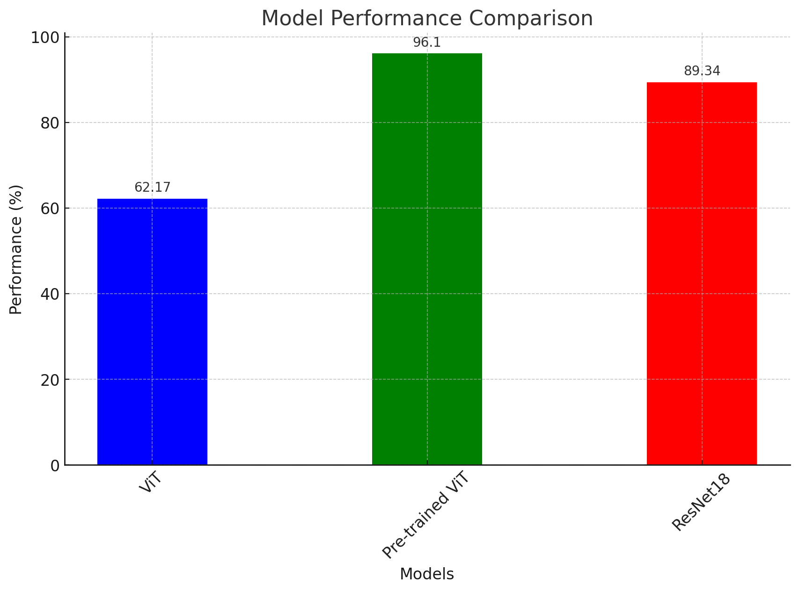

# CIFAR-10 Vision Transformer
The notebook contains
* Building a vision transformer from scratch
* Training a pre-trained ViT 
* Comparing ViTs and CNNs

## Vision Transformer
In the first part, we trained the model with 20 epochs and 4 attention heads and 4 layers. Also embedding dimension has been set to 64.

## Pre-trained Vision Transformer
There is also a built-in version of ViT model which was trained on ImageNet-21k at resolution 224 * 224. Here we try this with 3 epochs model.

## Pre-trained CNN
ResNet18 with 3 epochs has been trained on the dataset.

## Results

